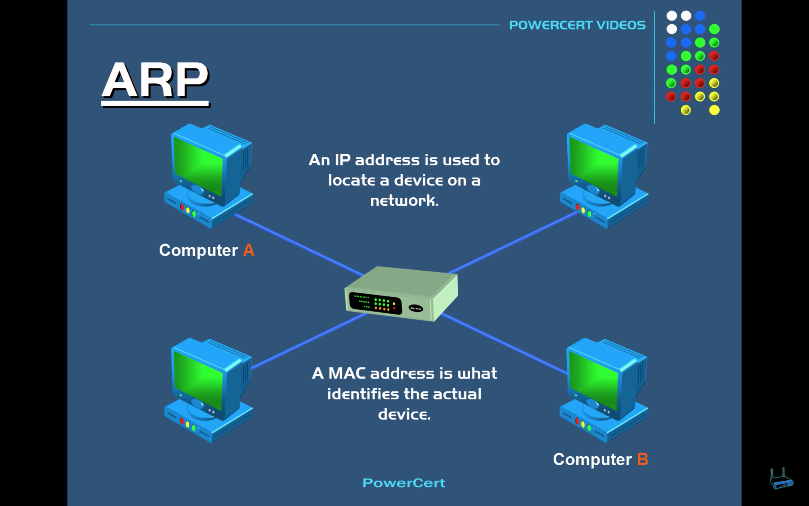
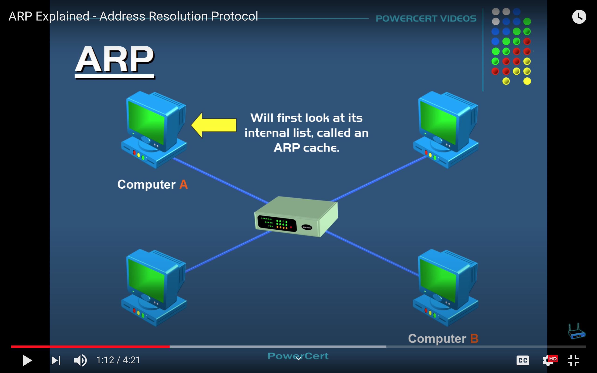
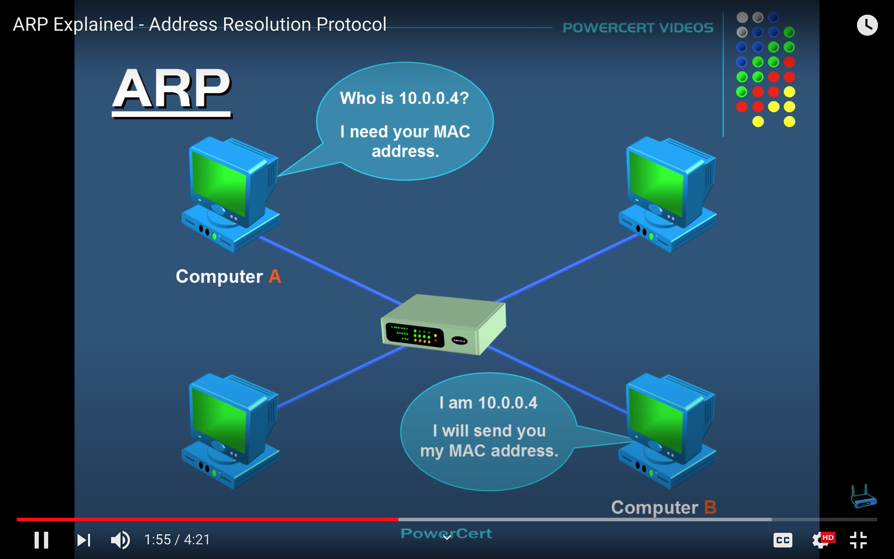
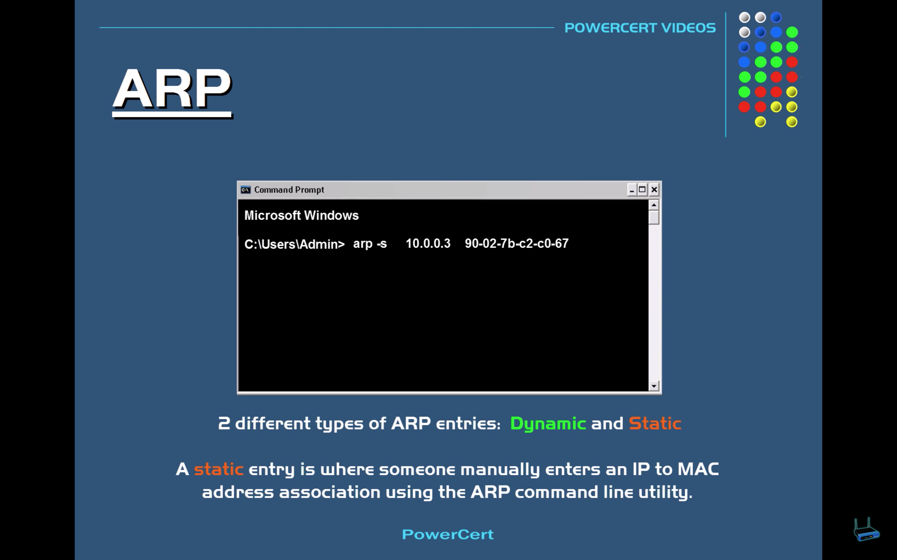

# MAC Address

# address resolution protocol (ARP)
- ARP helps source machine to obtain target machine eathernet address i.e. mac address
- Generally source machine only has IP address of target machine
- Once source machine gets mac address of target machine then it can send data

# How to get mac address for given ip address?
- lookup into ARP cache

- Check using `arp` cli

- Broadcast to all computers in network 

# Types of ARP
- Dynamic
  using broadcast approach 
- Static
  Someone manually entered manually

